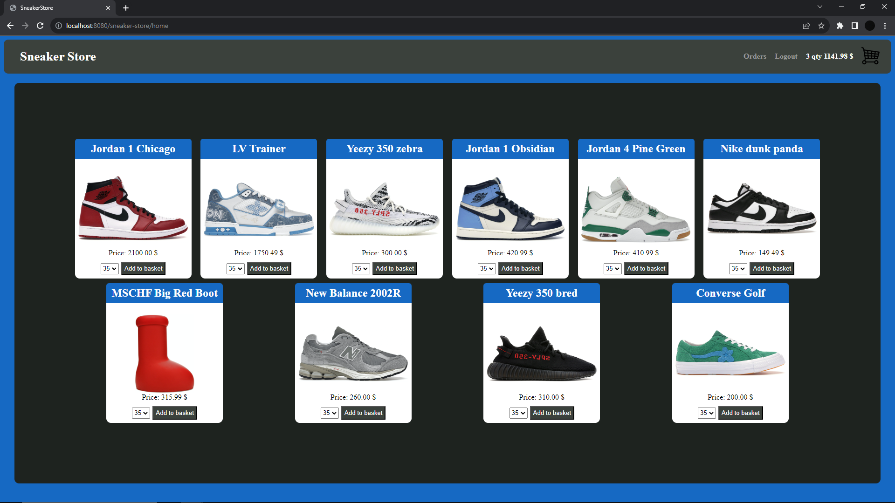

# Sneaker Store
This project is a dynamic web application made in Spring Boot with a basic front-end. The design pattern I used is model-view-controller (MVC) and code structured is by function. I tried to follow best practices in programming, such as SOLID, DRY.

## Demo on youtube!
[Watch the video](https://www.youtube.com/watch?v=rhmtXX-LMSM&ab_channel=Rafal)

## Functionalities of the application
- Registration
- Adding to and removing from the shopping basket
- Order processing
- Order history

#### Admin capabilities:
- Adding new items
- Editing and deleting items
- Viewing registered users list

## Technologies

Code: Java, Spring, Hibernate, MySQL

Front-end: Thymeleaf, Html, CSS

Tests: Junit, Mockito

## Home page view


## App deployed on Google Cloud
~~**Click** [here](https://metal-calculus-417018.lm.r.appspot.com)~~ not supported anymore

Already registered user:
    ```
    guest@example.com
    ```
    ```
    Password123
    ```

To login as admin:
    ```
    admin@admin.com
    ```
    ```
    Administrator
    ```

## How to build the project on your own
1. Clone repository
    ```
    git clone https://github.com/Gladziu/sneaker-store.git
    ```
2. Go to cloned repository
    ```
    cd sneaker-store 
    ```
3. Install dependencies
    ```
    mvn clean install
    ```
4. Create MySQL database schema
    ```
    mysql -u root -p
    create database sneakerstore;
    ```
5. Run the project
    ```
   mvn spring-boot:run
   ```
6. Preview
    ```
    http://localhost:8080
    ```
**Note that**
To create administrator profile, register with email: 
    ``` 
    admin@admin.com
    ```

